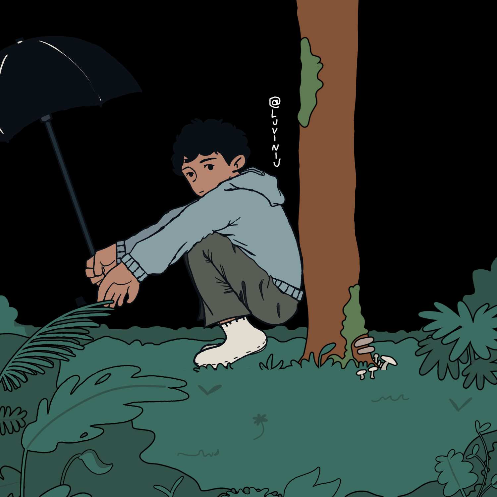
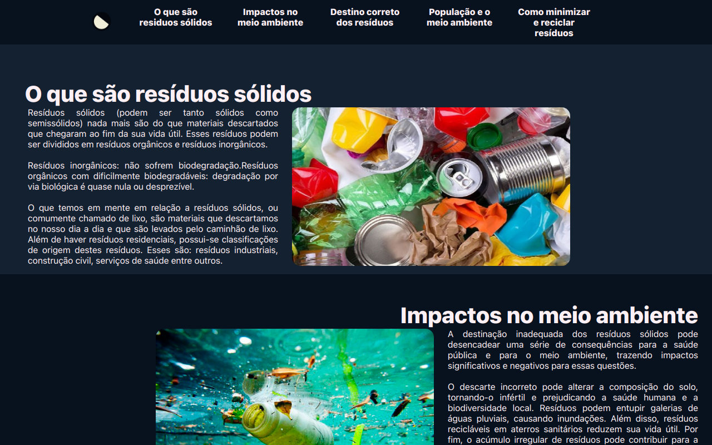

<h1>Opa, eai!</h1>
<a href="https://luviniu-portfolio.vercel.app/"></img></a>

 Meu nome é Luan, <b>estudante</b> de 17 anos
 Estudo no <b>IFB Campus Gama</b> e estou cursando <b>Técnico Integrado em Química</b>
 Desenho e programos umas besteiras como hobby
  Já fiz algumas comissões e sites

[[https://spotify-github-profile.kittinanx.com/api/view.svg?uid=31bx5bqxkeaebxsc763nkyhssujq&redirect=true][https://spotify-github-profile.kittinanx.com/api/view.svg?uid=31bx5bqxkeaebxsc763nkyhssujq&cover_image=true&theme=natemoo-re&show_offline=true&background_color=241f31&interchange=true&bar_color=613583&bar_color_cover=false)]]
<h2>Projetos!</h2>

<a href="https://tdar-rs.vercel.app/">
</img></a>

Trabalho TDAE 

<h2>Contatos</h2>

